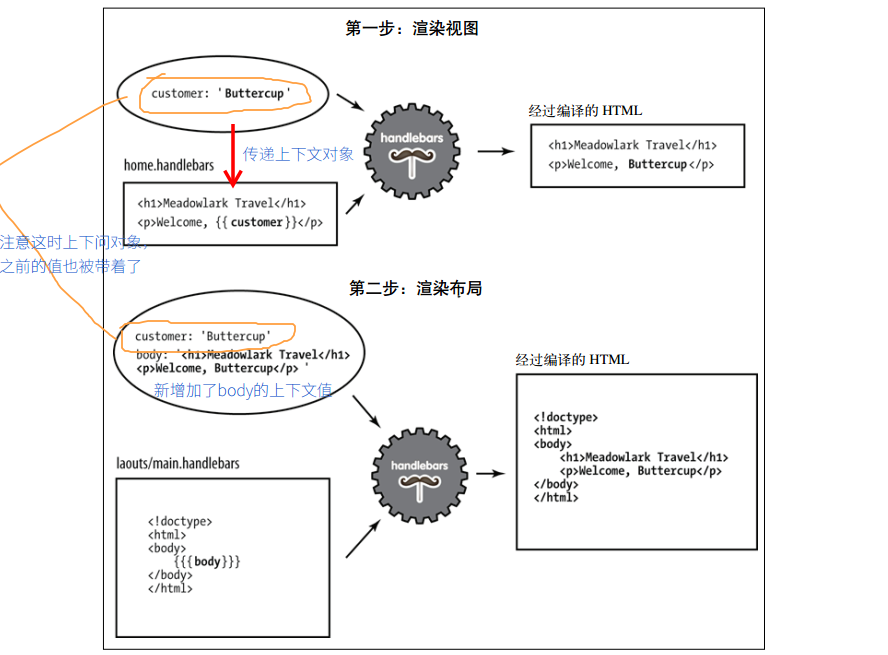

# handlebars注释 

**forReadme文件夹不是项目需要，是笔记引用图片自建文件夹**

## 视图(view)与布局(layout)理解

1. 视图表现为网站上的各个页面。
2. `handlebars`会在`view`文件夹下去找视图文件。
3. 布局是一种特殊的视图。
4. 布局是模板(视图view)的模板。
5. 布局文件放在`view/layout`下。

## 上下文对象(context)

## 视图渲染



## 在Express中使用布局渲染视图

1. 创建视图引擎时，指定默认布局(layout/main.handlebars)：


```
var handlebars = require('express3-handlebars').create({ defaultLayout: 'main' });

```

2. 使用默认引擎渲染`views/foo.handlebars`视图：

```
app.get('/foo', function(req, res){
    res.render('foo');
});
```

3.不使用模板渲染，可以在上下文中指定layout属性`null`:

```
app.get('/foo', function(req, res){
    res.render('foo', { layout: null });
});
```

4. 使用其他模板(views/layouts/microsite.handlebars )渲染视图：


```
app.get('/foo', function(req, res){
    res.render('foo', { layout: 'microsite' });
});
```
## 局部文件(partial)

1. 任何视图文件都可以使用局部文件，要确保每次请求都能传人上下文来渲染**局部文件**，可以将上下问对象放在全局对象`res`的属性`locals`：

```
//如果没有res.locals.partials这个属性，就把他设置为空对象，便于以后添加属性。
app.use(function(req,res,next){
	if(!res.locals.partials) res.locals.partials = {};
	res.locals.partials.weather = getWeatherData();//getWeatherDate()返回一个上下文对象，并将他保存在全局变量中。
	next();
});
```

2. 在视图中使用局部文件：

**`> partial_name`会搜索`views/partial`下的文件**


```
<h2>Welcome to Meadowlark Travel!</h2>
{{> weather}}
```

## 段落

**使用场景：** 如果某个视图需要不同于其他视图的元素，那么可以通过段落在main试图中添加段落来达到这样的目的。(只有当前视图需要一段jQuery代码)

1. 手动创建`section`处理方法：

```
var handlebars = require('express3-handlebars')
				.create({
					defaultLayout:'main',
//下面自定义helper方法来实现section方法，参考：http://www.cnblogs.com/lvdabao/p/handlebars_helper.html
					helpers:{
						section:function(name,options){
							if (!this._sections) this._sections = {};
							this._sections[name] = options.fn(this);
							return null;
						}
					}
				});

```

2. 创建我当前视图()，包含一段jQuery代码:

```
{{! 这里包含两个段落，一个meta段落，和一个jQuery代码，可以插入layout视图中的任何地方}}
{{#section 'head'}}
	<meta name = "robots" content = "noindex">
{{/section}}

<h1>Test Page</h1>
<p>We're testing jq stuff</p>

{{#section 'jquery'}}
	<script>
		$('document').ready(function(){
			$('h1').html('jquery works');
		});
	</script>
{{/section}}
```

3. 现在可以在layout视图中插入段落了：

```
<!doctype html>
<html>
    <head>
        <title>Meadowlark Travel</title>
    //下面插入段落，引用的格式是访问对象属性
        {{{_sections.head}}}
    </head>
    <body>
        {{{body}}}
        <script src="http://code.jquery.com/jquery-2.0.2.min.js"></script>
    //下面插入段落，引用的格式是访问对象属性
        {{{_sections.jquery}}}
    </body>
</html>
```

## 客户端handlebars

```
var source = $("#entry-template").html();//获取模板字符串
var template = Handlebars.compile(source);//Handlebars.compile()返回一个方法,方法接受一个参数(传入模板)
```

**类似如下方法:**

```
{{#section 'head'}}
	<script src="https://cdn.bootcss.com/handlebars.js/4.0.10/handlebars.js"></script>
	<script id="nurseryRhymeTemplate" type="text/x-handlebars-template">Marry had a little <b>\{{animal}}</b>, its <b>\{{bodyPart}}</b>was <b>\{{adjective}}</b> as <b>\{{noun}}</b>.
	</script>
{{/section}}

{{#section 'jquery'}}
	<script>
		$(document).ready(function(){
			var nurseryRhymeTemplate = Handlebars.compile(
				$('#nurseryRhymeTemplate').html()
				);
			var $nurseryRhyme = $('#nurseryRhyme');

			$('#btnNurseryRhyme').on('click', function(evt){
				evt.preventDefault();
				$nurseryRhyme.html(nurseryRhymeTemplate({
					animal: 'basilisk',
					bodyPart: 'tail',
					adjective: 'sharp',
					noun: 'a needle'
				}));
			});

			$('#btnNurseryRhymeAjax').on('click', function(evt){
				evt.preventDefault();
				$.ajax('/data/nursery-rhyme', {
					success: function(data){
								$nurseryRhyme.html(nurseryRhymeTemplate(data))
							}
				});
			});
		});
	</script>
{{/section}}

<div id="nurseryRhyme">Click a button....</div>
<hr>
<button id="btnNurseryRhyme">Generate nursery rhyme</button>
<button id="btnNurseryRhymeAjax">Generate nursery rhyme from AJAX</button>
```


